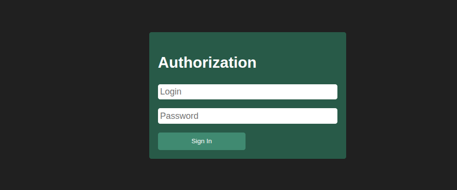
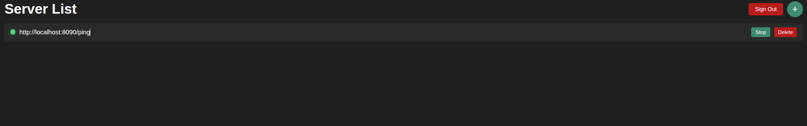
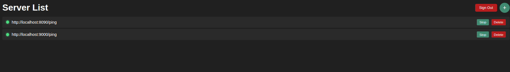

# SE Toolkit — Service Monitor

A real-time service monitoring platform that lets you track the health and availability of your web services through a WebSocket-powered dashboard.

## Demo

### Authorization


### Server List


### Add Server


### Monitoring Active


## Context

### End Users

System administrators, DevOps engineers, and developers who need to keep track of their deployed services and get instant visibility into their health status.

### Problem

Monitoring multiple services manually is tedious and error-prone. When a service goes down, you often discover it too late — after users have already complained.

### Solution

A centralized monitoring dashboard where users can register their services, start/stop monitoring, and receive real-time status updates via WebSocket connections. The backend worker periodically checks registered service endpoints and pushes status updates to connected clients.

## Features

### Implemented

- User authentication (sign-up / sign-in with JWT tokens)
- User profile management
- Add / remove services for monitoring
- Start / stop monitoring for each service
- Real-time status updates via WebSocket
- Background worker that periodically pings registered service URLs
- PostgreSQL for persistent storage
- Redis for pub/sub messaging between worker and API
- Alembic database migrations
- Docker Compose for easy deployment

### Not Yet Implemented

- Email / push notifications on service downtime
- Historical uptime statistics and analytics
- Configurable check intervals per service
- Service grouping and tagging
- Custom health check paths (e.g. `/health` instead of root)
- Response time metrics and charts
- Multi-user team dashboards

## Usage

### Prerequisites

- Docker & Docker Compose
- Python 3.12+ (for local development)

### Running with Docker Compose

```bash
# 1. Create .env file from template
cp .env_template .env

# 2. Fill in your database credentials in .env

# 3. Build and start all services
docker compose up -d --build
```

The following services will start:

| Service | Port | Description |
|---|---|---|
| App | `8000` | Main FastAPI application |
| Test Instance 1 | `9000` | Test service instance |
| Test Instance 2 | `9001` | Test service instance |
| Worker | — | Background monitoring worker |
| PostgreSQL | `5432` | Database |
| Redis | `6379` | Message broker |
| pgAdmin | `5050` | Database admin UI |

### Running Migrations

```bash
docker compose exec app poetry run alembic upgrade head
```

### Local Development

```bash
# 1. Install dependencies
poetry install

# 2. Create .env and configure database connection

# 3. Run migrations
poetry run alembic upgrade head

# 4. Start the server
poetry run uvicorn app.main:app --reload
```

### API Endpoints

#### Users

| Method | Endpoint | Description |
|---|---|---|
| POST | `/users/sign-up/` | Register a new user |
| POST | `/users/sign-in/` | Login and get JWT token |
| GET | `/users/profile/` | Get current user profile (requires auth) |

#### Services

| Method | Endpoint | Description |
|---|---|---|
| POST | `/services/add` | Add a new service for monitoring |
| POST | `/services/monitor/{id}` | Start monitoring a service |
| POST | `/services/stop_monitor/{id}` | Stop monitoring a service |
| GET | `/services/list/` | List all user's services |
| DELETE | `/services/remove/{id}` | Remove a service |

#### WebSocket

| Endpoint | Description |
|---|---|
| `/monitor` | WebSocket connection for real-time status updates (requires JWT token) |

## Architecture

- **FastAPI** — REST API and WebSocket server
- **PostgreSQL** — persistent data storage (users, services)
- **Redis** — pub/sub messaging between API and worker
- **Background Worker** — periodically checks service health and publishes status updates
- **WebSocket** — pushes real-time updates to connected clients

## License

MIT
